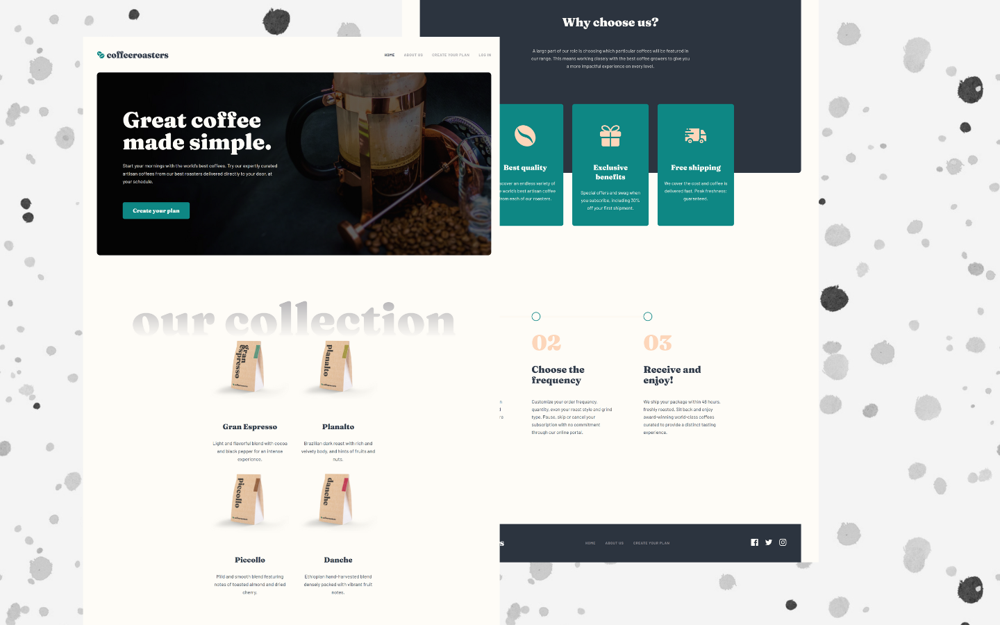
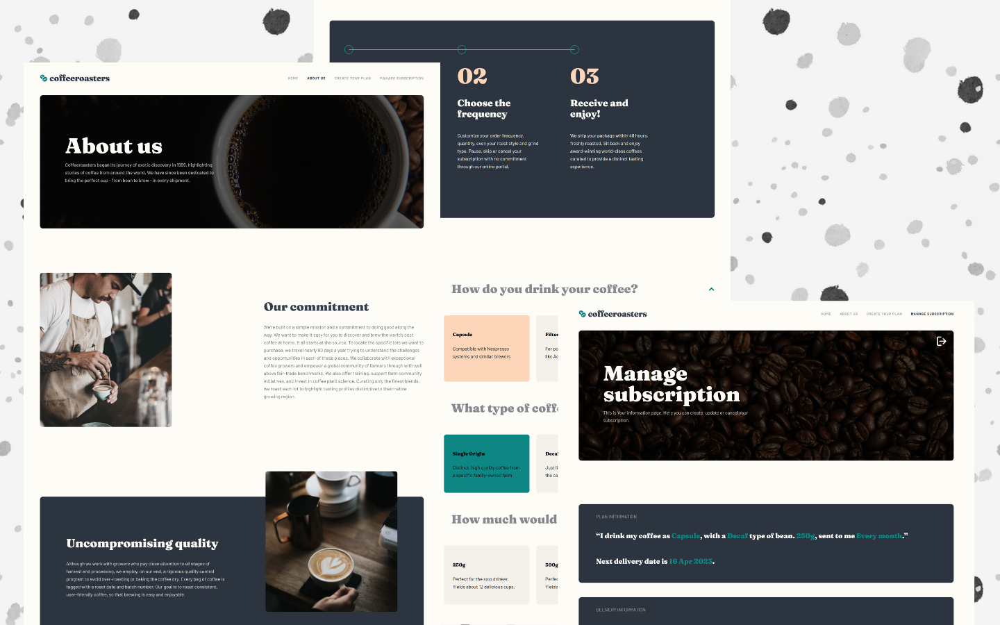
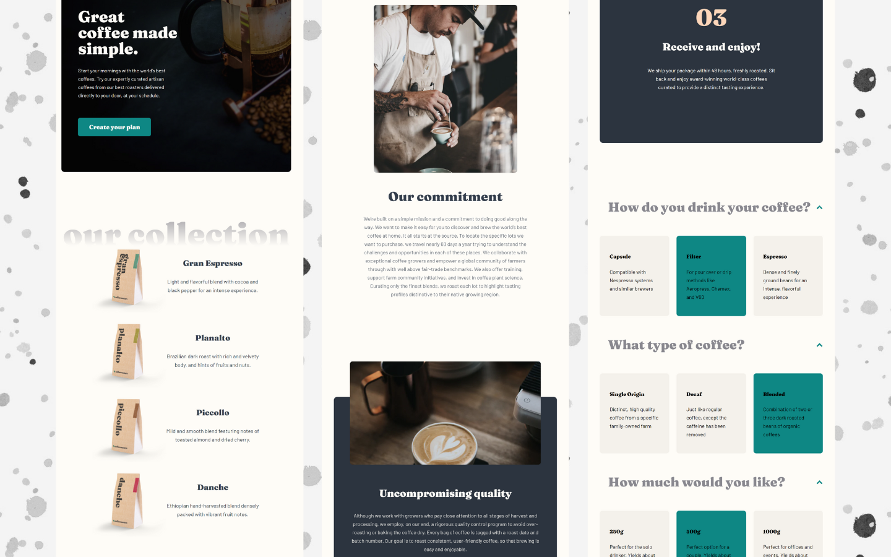
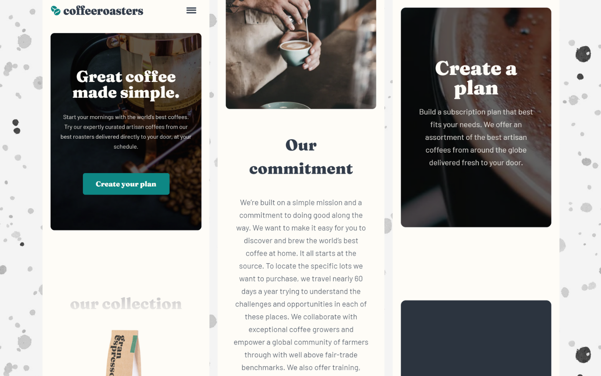

<h2>About the project</h2>

<b>CoffeeRoasters</b> website is an online platform allows users to create a subscribe to get fresh coffee of their liking.

👉 Live Demo: <a href='https://coffeeroasters-irinakruglova.vercel.app/'>CoffeeRoasters Demo</a>

<h3>Build with:</h3>

» React JS  
» React Redux  
» TypeScript  
» Firebase  
» SASS  

 

<h2>Screenshots of the Project</h2>
 
<h3 align='center'>Desktop</h3>

 
<h3 align='center'>Inner pages</h3>

 
<h3 align='center'>Tablet</h3>

 
<h3 align='center'>Mobile</h3>

